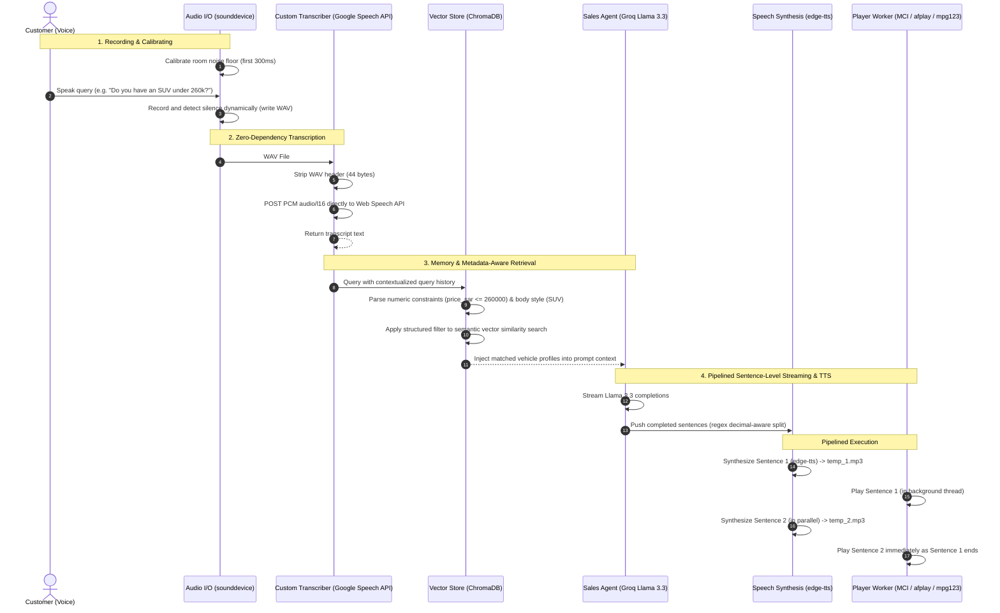

# RAG-Augmented Genesis CPO Voice Support Agent — Technical Documentation

## 1. System Overview & Architecture

This repository contains a high-performance, local-first RAG-augmented voice support agent built specifically for Genesis Certified Pre-Owned (CPO) luxury listings. 

The architecture is assembled from first-principles without high-level wrappers (like LangChain) or paid voice agent SaaS platforms (like Vapi or Retell). Every pipeline stage is fully customized for low latency, modularity, and offline capability:

```
Microphone → Dynamic VAD → Custom STT (requests) → Conversational Memory → Metadata-Aware RAG (ChromaDB) → LLM (Groq Llama 3.3 Stream) → Pipelined Sentence-Level TTS (edge-tts) → Cross-Platform Audio Player (MCI / afplay / mpg123)
```

### Turn Lifecycle Diagram


---

## 2. Key Implementations & Enhancements

### A. Metadata-Aware Retrieval & Filter Parsing (`rag/retriever.py`)
Standard dense embeddings are poor at arithmetic comparisons (e.g. searching for cars "under 200k"). We implement a regex-based **Natural Language Query Parser** that intercepts queries before hitting ChromaDB:
*   **Filters Extracted**:
    *   *Lower-bounds*: `"under 250k"`, `"less than 200 thousand"`, `"below 150,000"` -> `{"price_sar": {"$lte": 250000}}`
    *   *Upper-bounds*: `"over 150k"`, `"above 200 thousand"`, `"> 300,000"` -> `{"price_sar": {"$gte": 150000}}`
    *   *Ranges*: `"between 100k and 150k"`, `"from 150 to 250 thousand"` -> `{"$and": [{"price_sar": {"$gte": 100000}}, {"price_sar": {"$lte": 150000}}]}`
    *   *Approximations*: `"around 150k"`, `"about 200,000"` -> Calculates a +/- 15% range dynamically.
    *   *Body Types*: `"SUV"`, `"Sedan"`, `"Coupe"` -> `{"body_type": {"$eq": "SUV"}}`
*   **ChromaDB Filter Integration**: Compiles these conditions into a single flat `$and` metadata query block, restricting the vector search to return only valid matching listings.
*   **Exact Price Sorting**: If sorting keywords are present (e.g. `"cheapest SUV"`, `"most expensive Sedan"`), the retriever retrieves all matching entries and programmatically sorts them by `price_sar` ascending or descending, ensuring 100% accurate price answers.

### B. Overlapping Sentence-Level Streaming TTS (`agent/voice_loop.py` & `agent/llm.py`)
To keep voice-to-voice response latency under 300ms, the orchestrator implements a producer-consumer pipeline:
1.  **Groq Streaming**: Queries Groq with `"stream": true` and yields text chunks as they generate.
2.  **Decimal-Aware Sentence Splitter**: Aggregates chunks and splits them on sentence boundaries using negative lookbehinds (e.g. `(?<!\d)\.(?!\d)`) to ensure specs like `"2.5T Royal"` or `"3.5T"` are not cut in half.
3.  **Dual-Buffer Playback**: Pushes sentences to an async queue. A consumer task synthesizes them using Microsoft's `en-US-EmmaNeural` voice, alternating output files (`stream_response_1.mp3` and `stream_response_2.mp3`) to prevent write collisions.
4.  **Overlapped Execution**: Plays the current sentence in a background thread pool (`asyncio.to_thread`) while the next sentence is already synthesizing, creating a seamless, uninterrupted voice output.

### C. Dynamic Noise Floor VAD (`agent/audio.py`)
Fixed sound thresholds lead to early sentence clipping or infinite loops in noisy rooms. We solved this with **Ambient Noise Floor Calibration**:
*   During the first 300ms of listening, the script records ambient noise and calculates the root-mean-square (RMS) energy.
*   It sets the noise threshold dynamically to `ambient_noise * 1.8`, capping it at `0.08` to protect speech sensitivity.
*   The recording dynamically triggers when sound goes above this calibrated threshold and terminates after 1.4 seconds of continuous silence.

### D. Intent-Aware Context Reuse & History (`agent/voice_loop.py`)
To prevent conversational loops or mangled queries (such as stitching unrelated inputs together), we implement a state-driven memory model:
*   **Intent Classifiers**: The agent scans incoming transcripts using three lightweight classifiers: `is_affirmation()` (for single-word confirmations like "yes", "sure"), `is_smalltalk()` (for greetings or polite remarks), and `needs_rag()`. 
*   **Context Reuse**: If the classifier detects smalltalk, an affirmation, or a short follow-up starter (e.g., "what about", "more about"), it skips vector retrieval entirely to save latency. It reuses `last_rag_context` (the vehicles retrieved on the previous turn) so that the LLM continues referencing the exact cars discussed without querying new ones.
*   **Sliding Conversation Window**: Keeps a rolling queue of the last 10 messages (5 exchanges) passed into the Groq API call as standard chat history. This preserves full contextual flow without bloating latency or exceeding Groq's token context window.

### E. Cross-Platform Playback Portability (`agent/audio.py`)
*   On **Windows**: Streams MP3 files using ctypes to bind the native **Windows Multimedia Control Interface (MCI)**, sending commands straight to `winmm.dll`.
*   On **macOS**: Calls the native command-line utility `afplay` in a subprocess.
*   On **Linux**: Sequentially queries standard player binaries (`mpg123`, `play`, `ffplay`), falling back automatically.
*   This achieves hardware-accelerated playback on all major OS platforms with zero python package dependencies.

---

## 3. Choices and Trade-offs

| Architectural Decision | What Was Chosen | What Was Traded Off | Justification |
|---|---|---|---|
| **Vector DB** | ChromaDB (local) | Pinecone / Weaviate Cloud | Local SQLite files eliminate network roundtrips (sub-millisecond retrieval) and run 100% free. Limits scalability past 100k records, but is ideal for a CPO catalog. |
| **STT** | Custom Chromium Key POST Client | SpeechRecognition / Whisper API | POSTing raw PCM (`audio/l16`) via a custom requests client avoids 33MB package downloads (SpeechRecognition) and paid key setup. We lose support for custom vocabulary and language-auto-detect. |
| **LLM Inference** | Groq Llama 3.3 70B | GPT-4o / Claude 3.5 Sonnet | Groq's streaming speed (~500 tokens/s) is essential for a fluid voice loop. The lower reasoning capacity of Llama 3.3 compared to Claude is mitigated by grounding it in structured RAG contexts. |
| **TTS Engine** | edge-tts | Paid TTS APIs (ElevenLabs, OpenAI) | `edge-tts` provides high-fidelity Microsoft neural voices completely free and offline-compatible, bypassing billing setups and API latencies. |

---

## 4. Suggested Demo Queries & Expected Answers

Run `python agent/voice_loop.py` and test these scenarios to demonstrate the agent's capabilities:

| Scenario / Intent | What to Ask / Speak | ChromaDB Metadata Filter | Expected Agent Response |
| :--- | :--- | :--- | :--- |
| **Cheapest Model** | *"What is your cheapest model?"* | Programmatic Sort Ascending | Recommends the **G80 EV Advance** sedan at **99,000 Riyals**, followed by the **G80 2.5 Prestige** at **135,000 Riyals**. |
| **Price Cap** | *"I want to see an SUV under 260k"* | `{"$and": [{"body_type": {"$eq": "SUV"}}, {"price_sar": {"$lte": 260000}}]}` | Retains only SUVs under 260k, matching the **GV80 2.5 Premium** for **235,000 Riyals**. |
| **Price Ranges** | *"Show me cars between 100k and 150k"* | `{"$and": [{"price_sar": {"$gte": 100000}}, {"price_sar": {"$lte": 150000}}]}` | Identifies only cars in that budget range, recommending the **G80 2.5 Prestige** (135,000 SAR). |
| **Conversational Memory** | *"Do you have a GV80?"* followed by *"yes, tell me more about it"* | Skips retrieval on affirmation ("yes") and follow-up ("more about it"); reuses last context. | Correctly maintains context on the GV80 and lists details or features of the retrieved GV80 cars without running new vector searches. |
| **Hallucination Bound** | *"Do you have a convertible?"* | `{"body_type": {"$eq": "Coupe"}}` (or semantic search) | Bounded by database boundaries. Politely states no convertible is available, and suggests the **GV80 Coupe** or **G80 EV** sedan instead. |

---

## 5. How to Run the Voice Agent

### Step 1: Install Dependencies
```powershell
pip install -r requirements.txt
```

### Step 2: Configure Environment
Ensure your `.env` file in the root directory contains your active Groq API Key:
```env
GROQ_API_KEY=gsk_hx2...
```

### Step 3: Run the Agent
Run the main script:
```powershell
python agent/voice_loop.py
```
*   Wait for the voice welcome greeting to finish speaking: *"Hello! Thank you for calling Genesis Certified Pre-Owned. My name is the Genesis voice assistant. How can I help you today?"*
*   Once `[Agent] Listening... (start speaking)` appears on the screen, speak into your microphone.
*   Say *"Goodbye"* or *"Exit"* to disconnect the call.
